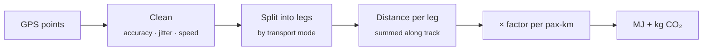

<div align="center">


# Trip Consumption Analysis

**Track your trips by transport mode and see what they cost in energy and CO₂ — entirely on your device.**

[](https://github.com/teefaxx/trip-consumption-analysis/actions/workflows/deploy.yml)
[](LICENSE)
[](https://react.dev)
[](https://www.typescriptlang.org)

[**Open the app →**](https://teefaxx.github.io/trip-consumption-analysis/)

</div>

---

## What it is

A browser-only progressive web app for personal mobility accounting. You start a trip,
the app follows your GPS, you switch transport mode as you change vehicles, and on
"End trip" you get the energy use and CO₂ footprint of what you just travelled.

GPS tracking, the calculation and storage all run in the browser. There is no backend
and nothing leaves the device — the only network calls are for the map tiles.

## Features

| | |
|---|---|
| 🗺️ **Live tracking** | Follow your route on a map, switch transport mode mid-trip, get an instant energy/CO₂ summary when you stop. |
| 📅 **Day history** | Pick a day and see its legs on the map coloured by mode, with totals and a per-mode breakdown. |
| 💾 **Local-first** | Trips live in IndexedDB. Export/import as JSON to back up or move between devices. |
| 📥 **Legacy import** | Load the 2022 course dataset straight from its CSV file. |
| 📱 **Installable PWA** | Offline app shell; the basemap still needs a connection. |

## How the numbers are computed



Factors come from the Swiss **mobitool** set (v3.1), full life cycle, per passenger-km:

| Mode | MJ / pax-km | kg CO₂ / pax-km |
|---|---:|---:|
| Car | 4.474 | 0.1864 |
| Train | 0.177 | 0.00703 |
| Bus | 3.431 | 0.1338 |
| Tram | 1.450 | 0.04279 |
| E-Bike | 0.242 | 0.01133 |
| CO₂-neutral (foot, bicycle) | 0 | 0 |

> [!NOTE]
> Row choices, caveats and the values recomputed from mobitool's own inventory are
> documented in [`docs/mobitool-factors.md`](docs/mobitool-factors.md). The full engine
> spec lives in [`docs/modernization-plan.md`](docs/modernization-plan.md). The app's
> About page shows the active factor set and its source.

## Quick start

```bash
git clone https://github.com/teefaxx/trip-consumption-analysis.git
cd trip-consumption-analysis
npm install
cp .env.example .env     # set VITE_MAPBOX_TOKEN=pk.…
npm run dev              # http://localhost:5173/trip-consumption-analysis/#/
```

> [!IMPORTANT]
> The map needs a Mapbox **public** token (`pk.…`). Create one at
> [account.mapbox.com](https://account.mapbox.com/) and restrict its allowed URLs to
> `http://localhost:*` and your Pages origin. Without it the app runs but the basemap
> shows an error banner.

### Scripts

| Command | What it does |
|---|---|
| `npm run dev` | Vite dev server with HMR |
| `npm test` | Vitest unit tests (16 suites, engine + storage + store) |
| `npm run lint` | oxlint |
| `npm run build` | Type-check (`tsc -b`) and production build |
| `npm run preview` | Serve the production build locally |

Requires Node 22 (the version CI builds with).

## Project structure

```
src/
├── lib/          calculation engine — pure TypeScript, unit-tested
├── storage/      trip persistence (Dexie / IndexedDB)
├── store/        app state (zustand)
├── hooks/        geolocation, day queries
├── components/   shared UI
└── pages/        Track · History · About
docs/             modernization plan, mobitool factor research
legacy/           the 2022–2023 course project (not deployed)
```

The engine in `src/lib/` has no React or browser dependencies, which is why it is the
part that carries the tests.

## Deployment

`main` is always live. Work happens on short-lived feature branches merged through pull
requests; CI (lint, type-check, tests, build) runs on every pull request, and a push to
`main` builds and deploys to GitHub Pages. The workflow also has a manual trigger
("Run workflow") to deploy any branch to the live URL for phone testing — redeploy
`main` afterwards to restore the production build.

<details>
<summary><b>One-time repository setup</b></summary>

<br>

- **Settings → Secrets and variables → Actions** → new secret `MAPBOX_TOKEN`, a Mapbox
  **public** token restricted to `http://localhost:*` and this repo's GitHub Pages
  origin. A URL-restricted public token is expected in a static site's client bundle;
  the restriction is what protects the quota.
- **Settings → Pages → Source:** GitHub Actions.
- **Settings → Environments → `github-pages` → Deployment branches and tags:** add a
  rule for `refactor/*` (or choose "No restriction"). GitHub creates this environment
  with a `main`-only rule, and without the extra rule the manual "Run workflow" deploy
  of a feature branch fails at the deploy step with *"not allowed to deploy to
  github-pages due to environment protection rules"*.

</details>

## Legacy version

<details>
<summary><b>About the original 2022–2023 course project</b></summary>

<br>

The original course project (Flask + PostGIS backend, Leaflet frontend) is kept under
[`legacy/`](legacy/) for reference and is not part of the deployed app.

Contributors: Dario De Luca, Luca Dominiak, Leonard Haas, Raúl Lara.

</details>

## License

[MIT](LICENSE) © Dario De Luca
